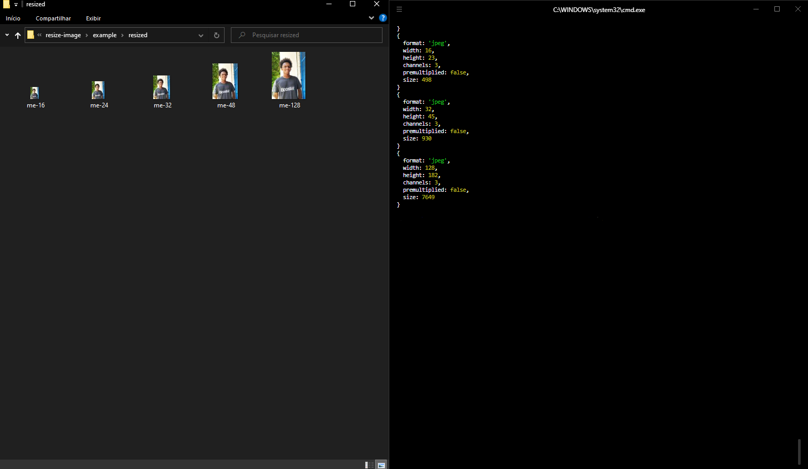

# Resize Image

📏 A simple application in NodeJS to resize images to different sizes with just one command.



<p align="center">
  
     
   

   

   

   

  <a href="https://github.com/gabrieldejesus">
    
  </a>
</p>

## 🛠 Getting started

Windows:

You can clone the repository through CMD (Command Prompt) just by typing:

```sh
git clone https://github.com/gabrieldejesus/resize-image
```

or download the zip from the green button at the beginning of the repository


## 💻 Configuration for development

To run the project just go to your command terminal open the project folder and run the command `yarn` to install all the necessary dependencies.

Then just type in your terminal the command: `node index image-path-you-want-to-resize-your-extension-further`

Exemplo:
```sh
  node index me.jpeg
```

## 🗃 Release history

- 0.1.0
  - Project finalized and studying the possibility of adding new resources
  - The first suitable lauch
- 0.1.0
  - Work in progress

## 📝 Meta

Gabriel de Jesus – [My portfolio](https://gabrieldesenvolvedor.com) – devgabrieldejesus@gmail.com

Distributed under the MIT License. See [LICENSE](LICENSE) for more information.

[https://github.com/gabrieldejesus/resize-image](https://github.com/gabrieldejesus)

## 🚀 Contribution

1. Make the _fork_ of the project (<https://github.com/gabrieldejesus/resize-image/fork>)
2. Create a _branch_ for your modification (`git checkout -b my-new-resource`)
3. Do _commit_ (`git commit -am 'Adding a new resource ...'`)
4. _Push_ (`git push origin my-new-feature`)
5. Create a new _Pull Request_

**After your pull request is merged**, you can safely delete your branch.

---
